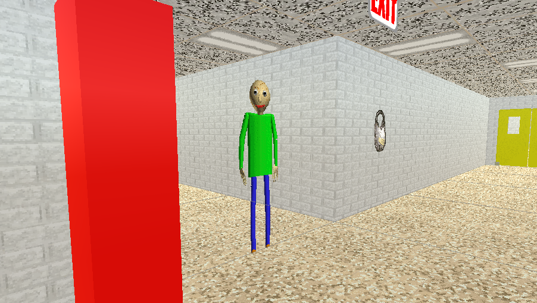

# Baldi's Basics Build 7 Decompile

A decompile of Baldi's basics prototype 7 

also known as (BBiEaL\_3-28-18 23;22.zip)

[Get the Decompile here](https://github.com/SillyMonkeyFlip/Baldi-s-Basics-Build-7-Decompile-Build-3-28-18-23-22-/releases)

[Get the Game here (BBiEaL (3-28-18 23;22.zip)](https://basically-games.itch.io/baldis-basics-classic-archives)

## Information

- Unity Version is 2022.3.62 (I converted it)
- Scripting Backend is Mono

## Credits

- Mystman12 - Creator of Baldi's basics 
- SillyMonkeyFlip - Decompiler and WebGL Compiler

## Media

